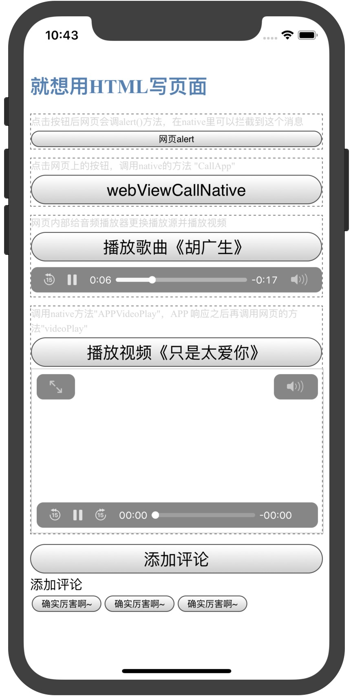

## WKWebView与JS的交互过程

OC和Swift两个版本，原理比较简单，UI如下：



### OC、Swift调用JS方法

JS准备一个方法

```
//等待native调用的方法
function videoPlay(videoUrl){
    var video = document.getElementById('id-my-video')
    video.setAttribute("src", videoUrl)
    video.play()
}
```

native去调用 `videoPlay(videoUrl)`

**OC:** 

```
NSString* url = @"http://muymov.a.yximgs.com/bs2/newWatermark/MTQwMjI4MjU2NDM_zh_4.mp4";

//  必须要有双引号
NSString* method = [NSString stringWithFormat:@"videoPlay(\"%@\")", url];
[self.webView evaluateJavaScript:method completionHandler:^(id _Nullable obj, NSError * _Nullable error) {
    if (error) {
        NSLog(@"%@", error);
    }else{
        NSLog(@"JS方法调用成功");
    }
}];
```

**Swift:**

```
let url = "http://muymov.a.yximgs.com/bs2/newWatermark/MTQwMjI4MjU2NDM_zh_4.mp4"
      
//  必须要有双引号
let method = "videoPlay(\"\(url)\")"
webView.evaluateJavaScript(method) { (obj, error) in
    if let myError = error {
        print(myError)
    }else{
        print("JS方法调用成功")
    }
}       
```

### JS调用OC、Swift方法

比如JS需要调用native的 `CallApp` 方法，那么在需要调用的地方写法如下：

```
var params = {'url': 'Call APP method "CallApp()"'}
window.webkit.messageHandlers.CallApp.postMessage(params);
```

按照如下的方法初始化 `WKWebView` ， 调用`addScriptMessageHandler: name`方法，注册 `CallApp` 方法，如下：

**OC:**

```
-(WKWebView *)webView{
    if (!_webView) {
        WKWebViewConfiguration* config = [[WKWebViewConfiguration alloc] init];
        config.allowsInlineMediaPlayback = YES;//可以禁止弹出全屏  网页video标签要加 上playsinline 这个属性
        WKUserContentController* uc = [[WKUserContentController alloc] init];
        config.userContentController = uc;
        [uc addScriptMessageHandler:self name:@"CallApp"];
        [uc addScriptMessageHandler:self name:@"APPVideoPlay"];
        //        其中name参数在JS里的写法如下：
        //        window.webkit.messageHandlers.CallApp.postMessage(params);
        //        就是 messageHandlers 后面的参数
        
        _webView = [[WKWebView alloc] initWithFrame:CGRectZero configuration:config];
        _webView.UIDelegate = self;
    }
    
    return _webView;
}
```

**Swift:**

```
    lazy var webView : WKWebView = {
        let config = WKWebViewConfiguration()
        config.allowsInlineMediaPlayback = true //可以禁止弹出全屏  网页video标签要加上 playsinline 这个属性
        let uc = WKUserContentController()
        config.userContentController = uc
        uc.add(self, name: "CallApp")
        uc.add(self, name: "APPVideoPlay")
        //        其中name参数在JS里的写法如下：
        //        window.webkit.messageHandlers.CallApp.postMessage(params);
        //        就是 messageHandlers 后面的参数
        
        let web = WKWebView(frame: .zero, configuration: config)
        //        webView.frame = view.bounds
        web.uiDelegate = self;
        
        return web
    }()
```

在 webView 的UIDelegate代理中可以拿到响应

**OC:**

```
#pragma mark - WKScriptMessageHandler
- (void)userContentController:(WKUserContentController *)userContentController didReceiveScriptMessage:(WKScriptMessage *)message{
    
    NSLog(@"方法名：%@", message.name);
    NSLog(@"参数：%@", message.body);
}
```

**Swift:**

```
//    MARK:WKScriptMessageHandler
func userContentController(_ userContentController: WKUserContentController, didReceive message: WKScriptMessage) {
        
    print("方法名：" + message.name)
    print("参数：\(message.body)")
}
```


